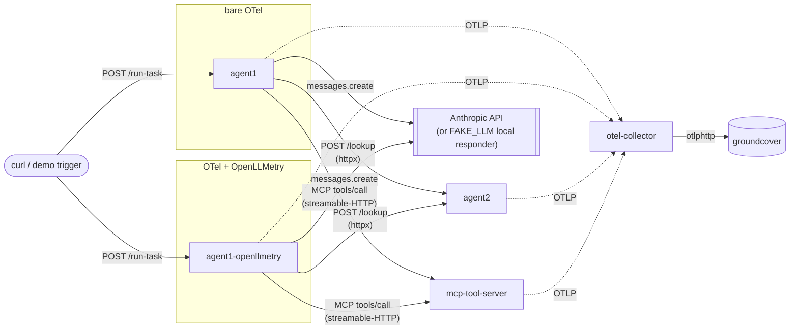
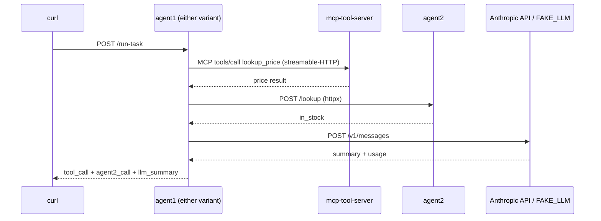

# MCP Tracing Demo

Real services, wired with genuine network calls, demonstrating what OTel
tracing does and doesn't give you automatically across an agent-to-agent
boundary, an agent-to-tool (MCP) boundary, and an agent-to-LLM boundary.

- `agent1` / `agent1-openllmetry` -- the hero agent. Same codebase, same
  image, one env var apart. On `/run-task` each does three real network
  hops: calls the MCP tool server (agent-to-tool), calls agent2
  (agent-to-agent), and calls the Anthropic API (agent-to-LLM). Both
  variants run permanently, side by side, so the "before OpenLLMetry" and
  "after OpenLLMetry" traces are always there to compare -- not just
  during whatever session happened to add OpenLLMetry.
- `agent2` -- delegation target, plain FastAPI, bare OTel auto-instrumentation.
- `mcp-tool-server` -- real MCP server on streamable-HTTP transport (not
  stdio), one tool (`lookup_price`), bare OTel, zero manual spans.
- `otel-collector` -- self-contained in this repo, forwards to groundcover.

## Architecture



All of it (agent1, agent1-openllmetry, agent2, mcp-tool-server,
otel-collector) runs in its own `mcp-agent-tracing` namespace in the
cluster, separate from unrelated cluster resources.

### Request flow



### One call, two span sets

```mermaid
flowchart TB
    call["anthropic_client.messages.create() -- one call"]
    call --> bareBranch["bare OTel<br/>(httpx auto-instrumentation only)"]
    call --> ollBranch["+ OpenLLMetry<br/>(added to the SAME TracerProvider)"]
    bareBranch --> bareSpan["POST span:<br/>http.method, http.url, http.status_code"]
    ollBranch --> ollSpan1["POST span<br/>(same as bare -- OpenLLMetry doesn't replace it)"]
    ollBranch --> ollSpan2["anthropic.chat span:<br/>gen_ai.request.model, gen_ai.usage.*,<br/>gen_ai.input/output.messages"]
```

Both span sets land on the exact same `trace_id` -- confirmed empirically,
not assumed (see "OpenLLMetry, measured" below).

## Quickstart

```bash
# 1. local sanity check
docker compose up --build
curl -X POST http://localhost:9001/run-task          # bare OTel
curl -X POST http://localhost:9011/run-task          # OpenLLMetry

# 2. build + push (via GitHub Actions -- see .github/workflows/build-push.yml)
git push   # triggers multi-arch (amd64+arm64) build+push automatically
# or: gh workflow run build-push.yml

# 3. deploy
kubectl apply -f k8s/namespace.yaml
kubectl create secret generic groundcover-token --from-literal=token='<token>' -n mcp-agent-tracing
kubectl create secret generic anthropic-api-key --from-literal=key='<key>' -n mcp-agent-tracing   # optional -- see FAKE_LLM below
kubectl create configmap otel-collector-config --from-file=config.yaml=otel-collector-config.yaml -n mcp-agent-tracing
kubectl apply -f k8s/otel-collector.yaml -n mcp-agent-tracing
kubectl apply -f k8s/manifests.yaml -n mcp-agent-tracing

# 4. trigger
kubectl port-forward svc/agent1 19001:9001 -n mcp-agent-tracing &
kubectl port-forward svc/agent1-openllmetry 19011:9001 -n mcp-agent-tracing &
curl -X POST http://127.0.0.1:19001/run-task
curl -X POST http://127.0.0.1:19011/run-task
```

Local ports are deliberately non-standard (19001/19011) to avoid
collisions with anything else already bound to 9001 on your machine --
see "Watch out for" below.

## Tracing: OTLP by default, JSON file as fallback

`tracing_lib.py` exports via OTLP (`OTEL_EXPORTER_OTLP_ENDPOINT`) to the
otel-collector, which forwards to groundcover. If that env var is unset,
it falls back to writing spans to a JSON-lines file per process instead
-- useful for local debugging without a collector running.

The `cluster`/`env` resource attributes groundcover uses for attribution
are **not** hardcoded -- they come from the `otel-collector-env`
ConfigMap (`GC_CLUSTER`, `GC_ENV`), so they're changeable without editing
the pipeline config or rebuilding anything.

## OpenLLMetry, measured

`ENABLE_OPENLLMETRY=1` layers OpenLLMetry (`traceloop-sdk`) onto the
**same** `TracerProvider` `tracing_lib.py` already set up -- not a
separate one. `Traceloop.init()` checks the current global
`TracerProvider`; if it's already real (not the default
`ProxyTracerProvider`), it attaches its own span processor to that
existing provider rather than creating a new one. Confirmed both by
reading `traceloop-sdk`'s own `init_tracer_provider()` source and
empirically, by matching `trace_id`/`parent_id` between the spans below.

Bare OTel auto-instrumentation and OpenLLMetry **cannot coexist in one
process** -- `Traceloop.init()` patches instrumentation process-wide.
That's why `agent1` and `agent1-openllmetry` are two separate, permanent
deployments sharing one codebase (`SERVICE_NAME` and `ENABLE_OPENLLMETRY`
are the only things that differ), rather than one agent that's edited in
place -- so the "before" state never gets lost.

**Bare OTel** (`agent1`) on the LLM call -- one generic span, nothing
LLM-specific:

```
Name: POST
http.method: POST
http.url: http://127.0.0.1:9091/v1/messages
http.status_code: 200
```

**OTel + OpenLLMetry** (`agent1-openllmetry`) on the exact same call --
the generic `POST` span above still exists (OpenLLMetry adds, it doesn't
replace), plus a new `anthropic.chat` span, same `trace_id`:

```
gen_ai.provider.name: anthropic
gen_ai.operation.name: chat
gen_ai.request.model: claude-haiku-4-5-20251001
gen_ai.request.max_tokens: 100
gen_ai.input.messages: [...]
gen_ai.response.model: claude-haiku-4-5-20251001
gen_ai.response.id: msg_...
gen_ai.response.finish_reasons: ["stop"]
gen_ai.output.messages: [...]
gen_ai.usage.input_tokens: 42
gen_ai.usage.output_tokens: 12
gen_ai.usage.total_tokens: 54
```

Cross-service trace continuity (`agent1`/`agent1-openllmetry` ->
`agent2` -> `mcp-tool-server`) holds for both variants -- verified
directly in groundcover, not just locally.

## FAKE_LLM: a real fallback, not a code-level mock

`FAKE_LLM=1` swaps the real Anthropic API for a **real local loopback
HTTP server** (`http.server.ThreadingHTTPServer` on `127.0.0.1:9091`)
returning a canned response. It's a demo-reliability fallback for flaky
wifi, rate limits, or a dead key mid-talk -- not a way to fake the
tracing story.

This matters because of what it's *not*: an `httpx.MockTransport`-based
mock. Testing both showed `HTTPXClientInstrumentor` patches httpx's
**default** transport, not custom ones -- so `MockTransport` silently
skips bare-OTel's generic HTTP span entirely, which would misrepresent
what a real call looks like. A real local HTTP server (genuine socket,
genuine request/response) doesn't have that problem: bare OTel sees the
exact same `POST` span it would against the real API, and OpenLLMetry's
`anthropic.chat` span still populates correctly since it wraps the SDK
method, not the transport.

## Known gaps, confirmed by running this

- **MCP's client transport uses a separate library (`httpx2`, not
  `httpx`) internally**, so standard `opentelemetry-instrumentation-httpx`
  produces zero generic HTTP spans for the agent-to-tool leg -- no status
  code, no transport-level latency. The MCP-specific spans still connect
  correctly (via the SDK's own internal tracing), they just don't carry
  those attributes. Confirmed by comparing the agent-to-agent leg (full
  `http.*` attributes) against the agent-to-tool leg (none) on the same
  trace.
- **`notifications/initialized` gets a disconnected `trace_id`.** The MCP
  client's post-`initialize` notification produces a span with a brand
  new `trace_id` and a null parent -- silently orphaned from the rest of
  the trace. Reproduced identically locally and in-cluster. Worth
  knowing: this is an artifact of the current (pre-2026-07-28-RC)
  stateful session handshake. The next-gen MCP spec eliminates that
  handshake entirely, so this specific gap has an expiration date -- it's
  evidence for the kind of rough edge the protocol is being redesigned to
  remove, not a permanent MCP quirk.
- **`httpx.MockTransport` bypasses bare-OTel's httpx instrumentation
  entirely** (see FAKE_LLM above) -- a blind spot in the instrumentation
  library itself, not the app.

## Watch out for

- **Cross-arch images.** GitHub Actions' default runners build `amd64`
  only; if your cluster node is ARM64 (e.g. a UTM VM on Apple Silicon),
  the pods will sit in `ImagePullBackOff` with "no match for platform in
  manifest." The workflow here builds `linux/amd64,linux/arm64` via
  `docker/setup-qemu-action` for exactly this reason.
- **Bind to `0.0.0.0`, not `127.0.0.1`, inside containers.** Binding to
  loopback makes a service unreachable from anything outside its own
  container -- including the host's port mapping and sibling containers.
  This breaks docker-compose and Kubernetes identically, so it's easy to
  mistake for a network policy or DNS issue when it's just this.
- **Stale `kubectl port-forward` processes silently steal `localhost`
  traffic.** If you leave a port-forward running from an earlier session
  on the same port docker-compose also maps, "local" curls can end up
  hitting the cluster instead -- with no error, just confusing results.
  Worth checking `lsof -iTCP:<port> -sTCP:LISTEN` before a long debugging
  session, not after.
