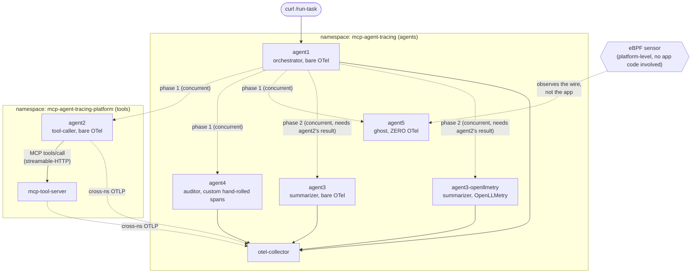
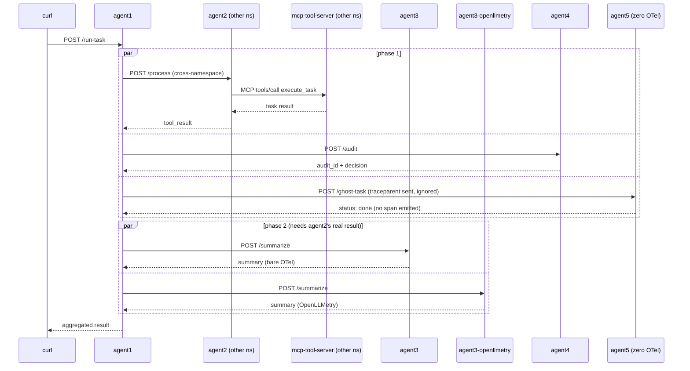
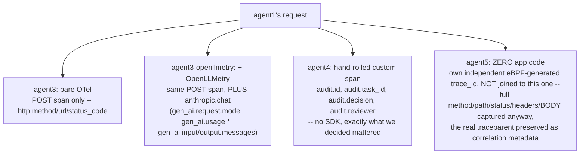

# MCP Tracing Demo

Real services, wired with genuine network calls, demonstrating what OTel
tracing does and doesn't give you automatically across an agent-to-agent
boundary, an agent-to-tool (MCP) boundary, an agent-to-LLM boundary, a
cross-namespace network boundary, and -- at the far end -- what's left
when an agent has no instrumentation at all and the only visibility
left is the platform's own eBPF sensor.

- `agent1` -- the orchestrator. On `/run-task` it fans out concurrently
  to five downstream agents and aggregates their results. No LLM call,
  no tool call, no custom spans of its own -- pure orchestration.
- `agent2` -- the tool-caller. Makes the real agent-to-tool call (MCP
  over streamable-HTTP) to `mcp-tool-server`. Lives in a separate
  namespace from the other agents (see below).
- `agent3` / `agent3-openllmetry` -- the summarizer. Same codebase, same
  image, one env var apart. Makes the real Anthropic API call. Both
  variants run permanently, side by side, so the "before OpenLLMetry"
  and "after OpenLLMetry" spans are always there to compare on the same
  trace -- not just during whatever session happened to add OpenLLMetry.
- `agent4` -- the auditor. Records a hand-rolled custom span for the
  incoming request, no vendor SDK, no auto-instrumentation beyond bare
  FastAPI for the inbound request. The third instrumentation tier.
- `agent5` -- the ghost. Zero OpenTelemetry. No `tracing_lib` import, no
  instrumentation, no manual spans, nothing -- the floor below the other
  three tiers. Whatever visibility exists for this one comes entirely
  from the cluster's own eBPF sensor, independent of anything the app
  does.
- `mcp-tool-server` -- real MCP server on streamable-HTTP transport (not
  stdio), one tool (`execute_task`), bare OTel, zero manual spans.
- `otel-collector` -- self-contained in this repo, forwards to groundcover.

## Architecture



One `/run-task` call fans out in two concurrent phases and produces ONE
trace containing agent2/agent3/agent3-openllmetry/agent4 and all three
of *their* instrumentation tiers as branches under `agent1`'s root span
-- no need to trigger separate endpoints to compare bare OTel vs.
OpenLLMetry vs. custom spans, it's all in one trace. Confirmed
empirically (see "Fan-out, verified" below), not assumed. `agent5` is
the deliberate exception -- same real call, same fan-out, but it never
joins that trace at all (see "agent5" below for what actually happens
instead).

`agent2` and `mcp-tool-server` live in a second namespace
(`mcp-agent-tracing-platform`) -- a real "agent team" vs. "platform/tools
team" boundary. The `agent1 -> agent2` hop, and `agent2`/`mcp-tool-server`'s
own OTLP export back to the collector, are genuine cross-namespace
network calls using FQDNs (`<svc>.<namespace>.svc.cluster.local`), not
same-namespace short-name DNS.

### Request flow



### Four visibility tiers, one request



The first three all land in the *same* OTel trace. `agent5` doesn't --
it's a genuinely different mechanism, not just a smaller version of the
same one. See "agent5: below zero" below for the actual captured data.

## Fan-out, verified

Fan-out is two concurrent phases, not five fully-independent calls,
because `agent3`/`agent3-openllmetry` summarize `agent2`'s *actual* tool
result -- they need it to exist first. `agent4` and `agent5` don't
depend on anyone else's result, so they run alongside `agent2` in phase
1 instead of waiting behind it. Confirmed by reading the actual span
tree: agent1's downstream `POST` spans to agent2/agent3/agent3-openllmetry/agent4
all share the same `parent_id` (`agent1`'s root `POST /run-task` span)
-- true sibling branches, not a chain -- and one `trace_id` spans those
five services across both namespaces, verified directly in groundcover.
`agent5` gets the same real call (same `traceparent` header sent, same
concurrent phase) but never reports back into that trace at all -- see
below.

## agent5: below zero, the eBPF floor

`agent5` has no `tracing_lib` import, no OTel SDK, no instrumentation of
any kind -- literally nothing. `agent1`'s outbound call to it still
produces a normal client-side `POST` span (that instrumentation lives on
the *caller*), but from `agent5`'s own side, nothing comes back: no
server span, no participation in the trace, `agent5` never once appears
as a `service.name` anywhere OTel-related. Confirmed locally by grepping
the collector's entire output for `agent-5` across an otherwise
successful request: zero matches.

In the cluster, querying groundcover directly for the same request finds
`agent5` anyway -- tagged `source: eBPF`, `tracer.name: kernelsocket`,
not `opentelemetry`:

```
service.name: agent5
span.name: POST /ghost-task
http.response.status_code: 200
request_body: {"task_id":"task-x"}
response_body: {"agent":"agent-5","task_id":"task-x","status":"done"}
client: agent1 (pod, namespace, IP all resolved)
server: agent5 (pod, namespace, IP all resolved)
```

Full method, path, status, headers, and **the entire request and
response body**, captured purely from watching the socket -- zero lines
of application code. The nuance worth being precise about: this span
lives on its own independently-generated `trace_id`, NOT the same one as
`agent1`'s real OTel trace for this request. eBPF doesn't join the
existing trace -- it makes its own. But it isn't blind to it either: the
captured HTTP headers include the real `traceparent` `agent1` sent
(since `agent1` *is* instrumented and propagates context to everything
it calls, whether or not the far end does anything with it), and the
span's own `tracing.w3c.trace_id` attribute is exactly `agent1`'s actual
trace_id for that request -- confirmed by matching the two directly.
That's the mechanism a platform like groundcover likely uses to
correlate an eBPF-only hop back to the real application trace in its UI,
even without a shared raw `trace_id` underneath.

## Fault tests: what actually breaking things looks like

Everything above is the happy path. `POST /run-task` with an optional
JSON body `{"fault": "<name>"}` deliberately breaks one specific leg --
no redeploy, safe to flip live mid-talk. `agent1` threads the same
`fault` value to every downstream call; each only acts on it if it's the
one that fault targets. Three code-level faults, plus one real network
failure tested separately (no code, just `kubectl scale`) -- all four
produce genuinely different signatures, not variations on one theme.

### `{"fault": "tool_error"}` -- mcp-tool-server raises

`execute_task` raises for this call. Confirmed by testing (don't
assume): MCP does **not** propagate this as a client-side exception --
`session.call_tool()` returns normally, with `is_error=True` on the
result and the error text inside `content`. (Caught a real bug in this
demo's own fault-test code here: this SDK uses snake_case `is_error`,
not the wire protocol's camelCase `isError` -- my first attempt checked
the wrong name and silently always read `False`.)

The failure *is* visible in the trace -- but only right at the source:
`mcp-tool-server`'s own `tools/call execute_task` span gets `status:
error`. Every layer above that stays healthy: `agent2`'s client-side MCP
span, `agent2`'s own `POST /process` span, and `agent1`'s aggregate all
stay `Unset`/200, because `agent2` catches this and reports
`tool_error: true` inline rather than raising.

### `{"fault": "llm_error"}` -- the fake LLM responder returns 500

The most instructive bug in this whole set was in the fault-injection
code itself, not the app: a single-shot "fail the next call" flag got
silently absorbed, every time, with `error: null` in the response as if
nothing happened. Cause: the `anthropic` SDK retries 5xx automatically
(`max_retries=2` by default) -- attempt 1 hits the fault and consumes
the flag, attempts 2 and 3 hit a healthy responder and succeed. Fixed by
holding the fault for the *whole* call instead of resetting after one
hit, so every retry attempt also fails and the real exception surfaces.

With that fixed, the bare-vs-OpenLLMetry contrast on an **actual
failure** is sharper than the happy-path one:

- **Bare OTel** (`agent3`): three generic `POST` spans (one per retry
  attempt, confirming the retry count directly), each `status: error`,
  with **no message content at all** -- just a category, no indication
  of what actually went wrong.
- **OpenLLMetry** (`agent3-openllmetry`): the `anthropic.chat` span gets
  `status: error`, `error.type: InternalServerError`, and a full OTel
  exception *event* -- `exception.type`, `exception.message`, and a
  complete Python stack trace -- plus the original `gen_ai.input.messages`
  that was being summarized when it failed. In a real incident, knowing
  *why* something failed matters more than knowing *that* it failed;
  this is the sharpest version of the bare-vs-OpenLLMetry story in the
  whole demo.

### `{"fault": "agent_error"}` -- agent4 raises an unhandled 500

Confirmed precisely, three layers deep:
- `agent4`'s own `POST /audit` span: `status: error`, `http_status_code: 500`.
- `agent1`'s outbound client span *to* agent4: also `status: error` --
  `HTTPXClientInstrumentor` correctly flags the 5xx response on the
  caller's side too.
- `agent1`'s own root span, and the HTTP response `curl` actually gets:
  **200**, with the 500's JSON body (`{"detail": "deliberate agent4
  failure for fault test"}`) embedded inside `agent4_call` as if it were
  a normal result.

The gap here isn't in observability -- the Error-status spans are
correctly there, at both ends of the failing call. The gap is that
`agent1`'s code never calls `resp.raise_for_status()` or checks
`resp.status_code`, so nothing in the application ever looks at the
signal that's already sitting right there in the trace.

### Real network failure -- `kubectl scale deployment agent5 --replicas=0`

No code, no fault flag -- an actual downstream outage. This one doesn't
get silently absorbed at all: `/run-task` itself returns **500**
(`Internal Server Error`, no JSON body -- Starlette's own default
handler, since nothing in `agent1` catches this). Confirmed the exact
mechanics in groundcover, not just the end result:

- `agent1`'s **root** `POST /run-task` span: `status: error`, with a
  full exception event -- `exception.type: httpx.ConnectError`,
  message `"All connection attempts failed"`, and a stack trace that
  names the exact line in `agent1.py` that raised it.
- `agent1`'s client span for the call *to agent5*: same exception,
  `status: error` -- the actual point of failure.
- `agent1`'s client span for the **concurrent** call to agent4 (a
  sibling in the same `asyncio.gather()`, not the one that failed):
  *also* `status: error`, but with a **different** exception --
  `httpx.ReadError`. That's `asyncio.gather()`'s cancel-siblings-on-first-exception
  behavior made visible: agent4's in-flight request got cut off mid-read
  when agent5's failure cancelled the whole gather, and that cancellation
  has its own distinct signature in the trace.

This is the one scenario in the whole set where the failure is loud
everywhere -- root span, every relevant child span, and the HTTP
response itself all agree something broke. Contrast that with the three
code-level faults above, all of which return 200 with the failure
quietly sitting inside the JSON payload. The difference isn't
"observability works here and not there" -- auto-instrumentation
correctly flags every one of these as an Error span. The difference is
whether the *application* raises, or catches and moves on.

## Quickstart

```bash
# 1. local sanity check (single flat network -- no namespace concept in compose)
FAKE_LLM=1 docker compose up --build
curl -X POST http://localhost:9001/run-task

# 2. build + push (via GitHub Actions -- see .github/workflows/build-push.yml)
git push   # triggers multi-arch (amd64+arm64) build+push automatically
# or: gh workflow run build-push.yml

# 3. deploy -- two namespaces
kubectl apply -f k8s/namespace.yaml
kubectl apply -f k8s/namespace-platform.yaml
kubectl create secret generic groundcover-token --from-literal=token='<token>' -n mcp-agent-tracing
kubectl create secret generic anthropic-api-key --from-literal=key='<key>' -n mcp-agent-tracing   # optional -- see FAKE_LLM below
kubectl create configmap otel-collector-config --from-file=config.yaml=otel-collector-config.yaml -n mcp-agent-tracing
kubectl apply -f k8s/otel-collector.yaml -n mcp-agent-tracing
kubectl apply -f k8s/manifests.yaml   # no -n flag -- every object carries its own namespace

# 4. trigger
kubectl port-forward svc/agent1 19001:9001 -n mcp-agent-tracing &
curl -X POST http://127.0.0.1:19001/run-task
```

Local port is deliberately non-standard (19001) to avoid collisions with
anything else already bound to 9001 on your machine -- see "Watch out
for" below.

## Tracing: OTLP by default, JSON file as fallback

`tracing_lib.py` exports via OTLP (`OTEL_EXPORTER_OTLP_ENDPOINT`) to the
otel-collector, which forwards to groundcover. If that env var is unset,
it falls back to writing spans to a JSON-lines file per process instead
-- useful for local debugging without a collector running.

The `cluster`/`env` resource attributes groundcover uses for attribution
are **not** hardcoded -- they come from the `otel-collector-env`
ConfigMap (`GC_CLUSTER`, `GC_ENV`), so they're changeable without editing
the pipeline config or rebuilding anything.

## Logs, correlated with traces

`tracing_lib.py` also bridges Python's stdlib `logging` module to an OTel
`LoggerProvider` + `OTLPLogExporter`, gated on the same
`OTEL_EXPORTER_OTLP_ENDPOINT`. No new dependencies -- `OTLPLogExporter`
ships in the same package already installed for trace export, and
`LoggingHandler` is part of `opentelemetry-sdk`.

Log records automatically pick up the `trace_id`/`span_id` of whatever
span is active when they're emitted (that's built into the SDK's
`LogRecord` construction, not something we wired up) -- confirmed by
matching `trace_id` between a request's spans and its log lines in
groundcover. One caveat, also confirmed: logs emitted *outside* any
active span (e.g. `mcp-tool-server`'s own uvicorn access logs, written
after the request's span has already ended) land with an empty
`trace_id` -- correlation only works while a span is genuinely open.

## OpenLLMetry, measured

`ENABLE_OPENLLMETRY=1` layers OpenLLMetry (`traceloop-sdk`) onto the
**same** `TracerProvider` `tracing_lib.py` already set up -- not a
separate one. `Traceloop.init()` checks the current global
`TracerProvider`; if it's already real (not the default
`ProxyTracerProvider`), it attaches its own span processor to that
existing provider rather than creating a new one. Confirmed both by
reading `traceloop-sdk`'s own `init_tracer_provider()` source and
empirically, by matching `trace_id`/`parent_id` between the spans below.

Bare OTel auto-instrumentation and OpenLLMetry **cannot coexist in one
process** -- `Traceloop.init()` patches instrumentation process-wide.
That's why `agent3` and `agent3-openllmetry` are two separate, permanent
deployments sharing one codebase (`SERVICE_NAME` and `ENABLE_OPENLLMETRY`
are the only things that differ), rather than one agent that's edited in
place -- so the "before" state never gets lost.

**Bare OTel** (`agent3`) on the LLM call -- one generic span, nothing
LLM-specific:

```
Name: POST
http.method: POST
http.url: http://127.0.0.1:9091/v1/messages
http.status_code: 200
```

**OTel + OpenLLMetry** (`agent3-openllmetry`) on the exact same call --
the generic `POST` span above still exists (OpenLLMetry adds, it doesn't
replace), plus a new `anthropic.chat` span, same `trace_id`:

```
gen_ai.provider.name: anthropic
gen_ai.operation.name: chat
gen_ai.request.model: claude-haiku-4-5-20251001
gen_ai.request.max_tokens: 100
gen_ai.input.messages: [...]
gen_ai.response.model: claude-haiku-4-5-20251001
gen_ai.response.id: msg_...
gen_ai.response.finish_reasons: ["stop"]
gen_ai.output.messages: [...]
gen_ai.usage.input_tokens: 42
gen_ai.usage.output_tokens: 12
gen_ai.usage.total_tokens: 54
```

## agent4: the third tier, hand-rolled

No SDK, no auto-instrumentation beyond bare FastAPI for the inbound
request -- just a few lines of `tracer.start_as_current_span(...)` with
attributes we picked ourselves:

```
Name: audit.record_decision
audit.id: <uuid>
audit.task_id: task-x
audit.decision: approved
audit.reviewer: agent-4-automated
```

That's the spectrum in one trace: bare auto-instrument gets you nothing
beyond generic HTTP shape; OpenLLMetry gets you a comprehensive
vendor-standard attribute set for free; hand-rolling gets you exactly
what you decided mattered, and nothing else, with a few lines of code
and no dependency.

## FAKE_LLM: a real fallback, not a code-level mock

`FAKE_LLM=1` swaps the real Anthropic API for a **real local loopback
HTTP server** (`http.server.ThreadingHTTPServer` on `127.0.0.1:9091`,
inside `agent3`/`agent3-openllmetry`) returning a canned response. It's
a demo-reliability fallback for flaky wifi, rate limits, or a dead key
mid-talk -- not a way to fake the tracing story.

This matters because of what it's *not*: an `httpx.MockTransport`-based
mock. Testing both showed `HTTPXClientInstrumentor` patches httpx's
**default** transport, not custom ones -- so `MockTransport` silently
skips bare-OTel's generic HTTP span entirely, which would misrepresent
what a real call looks like. A real local HTTP server (genuine socket,
genuine request/response) doesn't have that problem: bare OTel sees the
exact same `POST` span it would against the real API, and OpenLLMetry's
`anthropic.chat` span still populates correctly since it wraps the SDK
method, not the transport.

## Known gaps, confirmed by running this

- **MCP's client transport uses a separate library (`httpx2`, not
  `httpx`) internally**, so standard `opentelemetry-instrumentation-httpx`
  produces zero generic HTTP spans for the agent-to-tool leg (`agent2` ->
  `mcp-tool-server`) -- no status code, no transport-level latency. The
  MCP-specific spans still connect correctly (via the SDK's own internal
  tracing), they just don't carry those attributes. Confirmed by
  comparing the agent-to-agent leg (full `http.*` attributes) against
  the agent-to-tool leg (none) on the same trace.
- **`notifications/initialized` gets a disconnected `trace_id`.** The MCP
  client's post-`initialize` notification produces a span with a brand
  new `trace_id` and a null parent -- silently orphaned from the rest of
  the trace. Reproduced identically locally and in-cluster. Worth
  knowing: this is an artifact of the current (pre-2026-07-28-RC)
  stateful session handshake. The next-gen MCP spec eliminates that
  handshake entirely, so this specific gap has an expiration date -- it's
  evidence for the kind of rough edge the protocol is being redesigned to
  remove, not a permanent MCP quirk.
- **`httpx.MockTransport` bypasses bare-OTel's httpx instrumentation
  entirely** (see FAKE_LLM above) -- a blind spot in the instrumentation
  library itself, not the app.
- **OpenLLMetry's own MCP instrumentor silently fails to activate** on
  this pinned `mcp==2.0.0`. It bundles `opentelemetry-instrumentation-mcp`,
  which expects `mcp.client.streamable_http.streamablehttp_client` (an
  older/different SDK naming convention); our SDK actually exposes
  `streamable_http_client`. Confirmed in the real pod logs:
  `ERROR:root:Error initializing MCP instrumentor: module
  'mcp.client.streamable_http' has no attribute 'streamablehttp_client'`.
  It doesn't crash, it just never instruments. (Moot now that the MCP
  call lives in plain-bare-OTel `agent2` rather than an OpenLLMetry-enabled
  process, but the failure mode is real and worth knowing regardless.)
- **OpenLLMetry's logs-instead-of-attributes path
  (`Traceloop.init(use_attributes=False)`) needs `opentelemetry._events`,
  which doesn't exist in the pinned `opentelemetry-api==1.44.0`** (the
  Events API is still experimental upstream). Tested directly: setting
  `use_attributes=False` without it doesn't error and doesn't fall back
  to attributes -- it silently drops `gen_ai.input.messages`/
  `gen_ai.output.messages` with nowhere for them to land. A real
  capability, not reachable at these pinned versions.
- **Cross-namespace DNS worked cleanly, no NetworkPolicy or resolution
  issue** -- worth stating plainly since two earlier phases of this
  build *did* hit a real gap the moment a boundary was crossed (arch
  mismatch, host-binding). This one just worked. The one thing that
  actually changes going cross-namespace is using the FQDN
  (`agent2.mcp-agent-tracing-platform.svc.cluster.local`) instead of the
  short name that resolves fine same-namespace -- get that wrong and
  it's a DNS failure, not a tracing failure, but it'll look like a
  broken trace if you don't know to check DNS first.

## Watch out for

- **Set resource requests/limits, especially on a shared/constrained
  node.** Pods with none get `BestEffort` QoS -- the kernel's first
  OOM-kill target under memory pressure. Both instrumentation-tier agents
  got OOMKilled (exit 137) in the cluster before `k8s/manifests.yaml` had
  a `resources:` block, on a node that was already at 80% memory
  requested / 166% memory limits from unrelated workloads sharing it.
  Not specific to OpenLLMetry's heavier dependency footprint (the bare
  variant got killed too) -- it's a shared-cluster reliability issue,
  not an app bug.
- **Cross-arch images.** GitHub Actions' default runners build `amd64`
  only; if your cluster node is ARM64 (e.g. a UTM VM on Apple Silicon),
  the pods will sit in `ImagePullBackOff` with "no match for platform in
  manifest." The workflow here builds `linux/amd64,linux/arm64` via
  `docker/setup-qemu-action` for exactly this reason.
- **Bind to `0.0.0.0`, not `127.0.0.1`, inside containers.** Binding to
  loopback makes a service unreachable from anything outside its own
  container -- including the host's port mapping and sibling containers.
  This breaks docker-compose and Kubernetes identically, so it's easy to
  mistake for a network policy or DNS issue when it's just this.
- **Stale `kubectl port-forward` processes silently steal `localhost`
  traffic.** If you leave a port-forward running from an earlier session
  on the same port docker-compose also maps, "local" curls can end up
  hitting the cluster instead -- with no error, just confusing results.
  Worth checking `lsof -iTCP:<port> -sTCP:LISTEN` before a long debugging
  session, not after.
