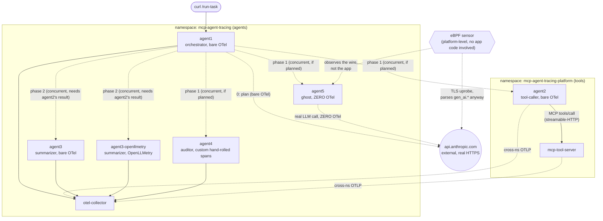
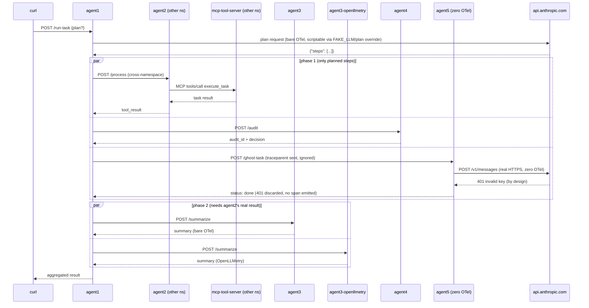
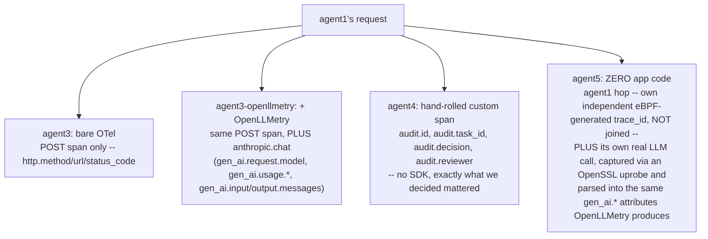

# MCP Tracing Demo

Real services, wired with genuine network calls, showing what OTel tracing gives you automatically across five kinds of boundary: agent-to-agent, agent-to-tool (MCP), agent-to-LLM, cross-namespace, and zero-instrumentation.

### What this is standing in for

None of this does real work. `execute_task` returns a hardcoded number, the LLM summarizes a made-up string. Read `task-x` as a stand-in for whatever object your own systems push through a pipeline (a ticket, an order, a claim). The real thing being modeled is the *shape*: one orchestrator fans a request out to a tool-caller, two LLM summarizers, an auditor, and a service nobody instrumented -- the smallest set that puts every boundary above on one comparable trace.

- `agent1`: the orchestrator. Entrypoint. Asks an LLM for a plan (which steps to run), then fans that plan out concurrently to the other four, aggregates their results. Bare OTel, same tier as `agent3`.
- `agent2`: the tool-caller. Stands in for a database/API lookup via `execute_task`, called over MCP on `mcp-tool-server`. Lives in its own namespace.
- `agent3` / `agent3-openllmetry`: the summarizer. Turns `agent2`'s result into a summary via a real Anthropic call. Same codebase, one env var apart, both deployed permanently so bare-OTel and OpenLLMetry are always side by side on the same trace.
- `agent4`: the auditor. Records a hand-rolled custom span, independent of whether the "real" work succeeded. The third instrumentation tier.
- `agent5`: the ghost. Zero instrumentation -- stands in for the service that predates the tracing effort. Still makes a real LLM call of its own; whatever visibility exists for either hop comes from eBPF alone.
- `mcp-tool-server`: real MCP server, streamable-HTTP, one tool (`execute_task`), bare OTel.
- `agent6`: optional, standalone -- not part of the fan-out. Runs a real call through the actual Claude Agent SDK, the harness Claude Code runs on. See "agent6" near the end.
- `otel-collector`: forwards to groundcover.

## Architecture



`agent1` opens every `/run-task` call with a real LLM call of its own -- a planning step that decides which of `process`/`audit`/`ghost` actually run. That response is scriptable: `POST /run-task {"plan": ["process","ghost"]}` dictates it directly, same real-call/scripted-body pattern as `agent3`'s `FAKE_LLM`. Omit `plan` and the LLM decides (or `FAKE_LLM`'s canned default: run everything); a bad response falls back to the full plan. The fan-out that follows produces one trace: whichever of `agent2`/`agent3`/`agent3-openllmetry`/`agent4` actually ran lands as a branch under `agent1`'s root span -- fewer branches if the plan skipped them, verified below. `agent5` is the exception regardless of plan -- it never joins the trace at all.

`agent2` and `mcp-tool-server` live in a second namespace (`mcp-agent-tracing-platform`), a real "agent team" vs. "platform team" boundary. The `agent1 -> agent2` hop, and both services' OTLP export back to the collector, cross that boundary over real FQDNs (`<svc>.<namespace>.svc.cluster.local`).

### Request flow



### Four visibility tiers, one request



The first three land in the same OTel trace, but `agent5` doesn't. It's the only agent making a second real network hop of its own, to a real LLM, with just as little app code behind it.

## Fan-out, verified

Fan-out is a plan, then two concurrent phases, not five independent calls: `agent3`/`agent3-openllmetry` summarize `agent2`'s actual tool result, so `agent2` has to run first (and only runs phase 2 at all if `agent2` was in the plan). `agent4` and `agent5` don't depend on anyone else, so they run alongside `agent2` in phase 1 instead of waiting behind it.

`agent1`'s downstream `POST` spans to agent2/agent3/agent3-openllmetry/agent4 all share the same `parent_id`. They are true siblings under `agent1`'s root `POST /run-task` span, and one `trace_id` spans all five services across both namespaces. `agent5` gets the same real call, same `traceparent`, same concurrent phase, but never reports back into that trace.

The plan genuinely changes the trace's shape, not just the response body. Two real calls, one with the default plan and one with `{"plan": ["process","ghost"]}`: the default trace has three `agent4` spans (`POST /audit`, `audit.record_decision`, plus HTTP framing); the overridden trace has zero `agent4` spans anywhere -- `agent1`'s planning call (a real `POST` to `/v1/messages`, same bare-OTel tier as the rest of `agent1`) is what decided that before the fan-out ever started.

## Fault tests: what actually breaking things looks like

`POST /run-task` with `{"fault": "<name>"}` deliberately breaks one leg, live, no redeploy. Three code-level faults, plus one real network failure (`kubectl scale`).

### `{"fault": "tool_error"}`: mcp-tool-server raises

`execute_task` raises. MCP doesn't propagate this as a client-side exception. `session.call_tool()` returns normally, with `is_error=True` on the result and the error text inside `content`.

Only `mcp-tool-server`'s own `tools/call execute_task` span gets `status: error`. Everything above it stays healthy: `agent2` catches the error and reports `tool_error: true` inline, so its own span, and `agent1`'s aggregate, both stay `Unset`/200.

### `{"fault": "llm_error"}`: the fake LLM responder returns 500

The `anthropic` SDK retries 5xx automatically (`max_retries=2`), so a one-shot "fail the next call" flag gets silently absorbed. Fixed by holding the fault for the whole call so every retry attempt fails too.

- **Bare OTel** (`agent3`): three generic `POST` spans (one per retry), each `status: error`, with no message content.
- **OpenLLMetry** (`agent3-openllmetry`): the `anthropic.chat` span gets `status: error`, `error.type: InternalServerError`, a full exception event (`exception.type`, `exception.message`, stack trace), plus the original `gen_ai.input.messages`.

### `{"fault": "agent_error"}` -- agent4 raises an unhandled 500

- `agent4`'s `POST /audit` span: `status: error`, `http_status_code: 500`.
- `agent1`'s client span to `agent4`.
- The HTTP response `curl` gets: **200**, with the 500's JSON body embedded inside `agent4_call` as if it were a normal result.

The Error-status spans are correctly there on both ends. The gap is that `agent1` never calls `resp.raise_for_status()`, so nothing in the app ever looks at the signal already sitting in the trace.

### Real network failure -- `kubectl scale deployment agent5 --replicas=0`

No code, no fault flag -- an actual outage. `/run-task` itself returns **500** (Starlette's default handler; nothing in `agent1` catches this).

- `agent1`'s root `POST /run-task` span: `status: error`,
  `exception.type: httpx.ConnectError`, `"All connection attempts
  failed"`, with a stack trace naming the exact line.
- `agent1`'s client span to `agent5`: same exception, the actual point of
  failure.
- `agent1`'s client span to `agent4` (concurrent sibling in the same
  `asyncio.gather()`, not the one that failed): also `status: error`, but
  a *different* exception -- `httpx.ReadError`. `asyncio.gather()` cancels
  siblings on first exception; `agent4`'s in-flight request got cut off
  mid-read, and that cancellation has its own signature in the trace.

This is the one scenario where the failure is loud everywhere. Root span, every child span, and the HTTP response itself all agree something broke. The three code-level faults above all return 200 with the failure sitting quietly inside the JSON payload instead. Auto-instrumentation flags every one of these correctly; the difference is whether the application raises, or catches and moves on.

## agent5: below zero, the eBPF floor

Every fault test above happened inside an instrumented service. The Error-status spans came from a library, not from `agent5`. `agent5` makes two real calls on `/ghost-task`, neither with any instrumentation:

1. `agent1 -> agent5` (agent-to-agent, internal HTTP).
2. `agent5 -> api.anthropic.com` (agent-to-LLM, external HTTPS). A real `AsyncAnthropic` call using a deliberately invalid key, so the failure is real and reproducible without a live secret. Point a real key at it (same `anthropic-api-key` secret `agent3` uses) for a real summary.

Neither call produces a span, log line, or trace_id from the app. Grepping the collector's output for `agent-5` across a request: zero matches. `agent5` also discards the result of call 2 entirely -- success or 401, it makes no difference -- and always replies to `agent1` with `{"status": "done"}`. `agent1`'s own aggregate response, and anyone reading it, sees a clean success. Nothing about the failure exists anywhere in the application layer.

**`agent1 -> agent5`**: tagged `source: eBPF`, `tracer.name: kernelsocket` -- full method/path/status/headers/body from watching the socket, on its own independently-generated `trace_id`, separate from `agent1`'s real trace. The captured headers include the real `traceparent` `agent1` sent, and the span's `tracing.w3c.trace_id` attribute matches `agent1`'s actual trace_id exactly.

**`agent5 -> api.anthropic.com`**: `tracer.name: opensslmbio`, an OpenSSL uprobe, not a socket read. groundcover decrypts the TLS session in-process and, recognizing Anthropic's wire format, parses it into the same `gen_ai.*` attributes OpenLLMetry produces by instrumenting the SDK directly:

```
protocol_type: gen_ai, subtype: anthropic
span.name: chat claude-haiku-4-5-20251001
is_encrypted: true
net.peer.name: api.anthropic.com   net.peer.port: 443
gen_ai.provider.name: anthropic
gen_ai.operation.name: chat
gen_ai.request.model: claude-haiku-4-5-20251001
gen_ai.request.max_tokens: 20
gen_ai.input.messages: [{"role":"user","parts":[{"type":"text","content":"..."}]}]
error.type: authentication_error
gen_ai.error.message: invalid x-api-key
issue_description: "Anthropic API Error"      <- auto-classified
request_body / response_body: full verbatim JSON, both directions
http_request_headers.x-api-key: "?"           <- the one redacted field
```

Cost-accounting fields (`gen_ai_pricing_model_id`, per-token pricing) are present too, zeroed only because the call fails before consuming tokens.

Nothing in the application says this broke -- `agent1` got its 200, `agent5` got its 200. eBPF is the only place the 401 exists at all: the exact prompt, the real response body and `request_id`, correct HTTP semantics, automatic provider classification, all captured independent of whether `agent5` ever chose to report anything.

## agent6: a different pattern -- the real Claude Agent SDK

Optional, standalone -- not wired into `agent1`'s plan. `agent6` runs five real, unscripted calls through the actual Claude Agent SDK, the same harness Claude Code runs on, chained telephone-game style: `reporter` improvises a short absurd status update about the task, then `supervisor`, `manager`, `legal`, and `support-rep` each react only to the previous persona's actual words. Each is a genuine `query()` call spawning its own real `claude` CLI subprocess and piping a prompt to it over stdio -- the LLM calls happen inside those subprocesses, not in this process. Unlike everything else in this demo, the content genuinely varies every run -- this is the one part of the whole build meant to be shown live and unscripted rather than reproducible.

Bare OTel here sees the inbound `POST /subprocess-task` span, same as every other agent -- and zero outbound span for the LLM call itself. There's no `httpx` call to patch: the subprocess makes the call, not this process. OpenLLMetry fares no better, since it patches the `anthropic` package's methods, and this SDK never touches that package here.

eBPF's floor is lower here than anywhere else in this demo. It captures the DNS lookups for `api.anthropic.com` (any process in the pod triggers those) but zero record of the actual TLS connection -- confirmed twice, `is_external:true` returns nothing for this pod in the same window `agent5`'s identical call produced a fully-parsed `gen_ai.*` span. The OpenSSL-uprobe mechanism behind `agent5`'s result apparently attaches to already-running processes' loaded libraries, not one spawned fresh mid-request with its own bundled crypto stack.

The CLI ships its own native OTel export -- `ENABLE_SDK_TELEMETRY=1` here, which sets `CLAUDE_CODE_ENABLE_TELEMETRY=1`, `OTEL_TRACES_EXPORTER=otlp`, and `CLAUDE_CODE_ENHANCED_TELEMETRY_BETA=1`, required for traces specifically. On by default in this deployment. When on, it genuinely joins the parent trace -- confirmed with real parent-child span IDs from the live deployment, not inferred: `claude_code.interaction`'s `parent_id` is `agent6`'s own root span ID, same `trace_id`, two `service.name`s cooperating correctly. Confirmed on both a deliberately-invalid-key failure and, separately, a genuinely successful call authenticated via `CLAUDE_CODE_OAUTH_TOKEN` (from `claude setup-token`) -- the join holds on both the failure and success path.

`agent6` itself (both eBPF, from the k8s object name, and this process's own OTel `service.name`, deliberately aligned to match -- see "agent4: the third tier" below for how the general naming drift surfaced). The five CLI subprocesses are a different story: their OTel `service.name` defaults to a hardcoded `claude-code` -- but it turns out that's not fixed after all. The CLI's telemetry is a standard OTel SDK underneath, so it honors the standard `OTEL_SERVICE_NAME` env var like any other OTel process would, code-level default or not. Each of the five persona calls now sets its own (`agent6-reporter`, `agent6-supervisor`, `agent6-manager`, `agent6-legal`, `agent6-support-rep`), confirmed live -- five distinctly-named lanes in one waterfall, in chain order, instead of five identical `claude-code` entries indistinguishable from each other.

Content is redacted by default even with the CLI's native telemetry on -- the spans and log events show up, but every field that would hold the actual prompt/response text is empty. Four separate opt-ins turn it back on: `OTEL_LOG_USER_PROMPTS`, `OTEL_LOG_RAW_API_BODIES`, `OTEL_LOG_TOOL_DETAILS`, `OTEL_LOG_TOOL_CONTENT` (on by default in this deployment, demo-only -- not something to default on for a real one). With them set, the content still doesn't land where you'd first look: `gen_ai_input_messages`/`gen_ai_output_messages` on the trace spans stay empty regardless, and the log events' own `body` field is also empty. The real text is in plain, differently-named fields per event -- `claude_code.user_prompt` logs carry it in `prompt`, `claude_code.assistant_response` logs carry it in `response` -- confirmed directly against a live call, five personas' worth of actual absurd text queryable in groundcover by `trace_id`/`session.id`. Bonus finding surfaced by finally seeing the content: the haiku "standalone" call each turn isn't a second response at all, it's a title classifier -- its `response` is a bare `{"title": "..."}` -- while the sonnet-5 `interaction` call carries the real persona text.

Cost didn't show up either, and for two separate reasons. First, groundcover's own `gc.llm_cost.status` attribute on the `claude_code.llm_request` span says `"computed"`, but there's no dollar-amount field anywhere on that span -- the real number lives in a dedicated metric instead, `claude_code_cost_usage_USD_total` (plus `claude_code_token_usage_tokens_total`, `claude_code_session_count_total`, `claude_code_active_time_seconds_total`), emitted by the CLI itself. Second, the otel-collector's own config only wired up `traces` and `logs` pipelines -- `service.pipelines` had no `metrics` entry, so every metric the `otlp` receiver accepted was silently dropped before it ever reached groundcover, independent of whatever the CLI sent. Fixed by adding a `metrics` pipeline alongside the other two in `otel-collector-config.yaml`, plus `OTEL_METRIC_EXPORT_INTERVAL=1000` next to the trace/log interval fix -- same reasoning as before, the subprocess is dead long before a 60s default metrics flush would ever fire. Confirmed against a live call: `claude_code_cost_usage_USD_total` for that exact `session_id`, split by `model` -- $0.0254511 for the sonnet-5 persona call, $0.000647 for the haiku title-classifier call, tied back to the same pod and namespace as everything else.

Worth noting for anyone re-pointed at this collector: it's one shared pipe, not a second metrics system. The `claude_code_*` metrics land in the same VictoriaMetrics-backed store groundcover's own eBPF sensor writes infra metrics into (`groundcover_kube_*`, `karpenter_*`, etc.) -- different producers, one store, same PromQL query surface either way.

A real bug turned up along the way: `query()` raises a trailing exception even after a well-formed message stream, on a low-level `"error": "success"` wire quirk -- fixed by only falling back to the exception string if no real assistant text was collected first. Also worth knowing: `ResultMessage.subtype == "success"` doesn't mean the task succeeded -- `is_error` and `api_error_status` carry the real outcome.

Weight: the bundled CLI binary is 291MB unpacked, ~76% of everything installed here, roughly 3x the size of the entire base Python image. Alpine doesn't shrink it -- pip falls back to building from source with no matching wheel, so no binary gets bundled at all and the SDK has nothing to spawn. That weight is the actual product being tested, not packaging overhead.

Scale: this isn't a normal stateless fleet. Per Anthropic's own hosting guidance, one agent session maps to one subprocess, sized around 1 GiB RAM / 1 CPU per real session as a starting point, with sessions pinned to specific containers via consistent hashing on session ID -- closer to scaling a stateful game server than a typical microservice. Their own recommended path if you don't want to run this infrastructure yourself is a separate hosted product, Managed Agents.

## Quickstart

```bash
# 1. local sanity check (single flat network -- no namespace concept in compose)
FAKE_LLM=1 docker compose up --build
curl -X POST http://localhost:9001/run-task

# 2. build + push (via GitHub Actions -- see .github/workflows/build-push.yml)
git push   # triggers multi-arch (amd64+arm64) build+push automatically
# or: gh workflow run build-push.yml

# 3. deploy -- two namespaces
kubectl apply -f k8s/namespace.yaml
kubectl apply -f k8s/namespace-platform.yaml
kubectl create secret generic groundcover-token --from-literal=token='<token>' -n mcp-agent-tracing
kubectl create secret generic anthropic-api-key --from-literal=key='<key>' -n mcp-agent-tracing   # optional -- see FAKE_LLM below
kubectl create configmap otel-collector-config --from-file=config.yaml=otel-collector-config.yaml -n mcp-agent-tracing
kubectl apply -f k8s/otel-collector.yaml -n mcp-agent-tracing
kubectl apply -f k8s/manifests.yaml   # no -n flag -- every object carries its own namespace

# 4. trigger
kubectl port-forward svc/agent1 19001:9001 -n mcp-agent-tracing &
curl -X POST http://127.0.0.1:19001/run-task

# 4b. script the plan directly -- skip the audit step, watch agent4 disappear from the trace
curl -X POST http://127.0.0.1:19001/run-task -d '{"plan": ["process", "ghost"]}'
```

Local port is non-standard (19001) to avoid colliding with anything else bound to 9001.

### Which script do I run?

All three are just wrappers around `curl` -- nothing here needs memorizing.

| Script | What it does | Use it when |
|---|---|---|
| `./scripts/call.sh` | One plain call to agent1's `/run-task`, no faults. `./scripts/call.sh 5` repeats it 5 times, pausing between each. | You want a clean trace, or want to show a real key producing a different summary/plan every run. |
| `./scripts/demo.sh` | Walks agent1 through the whole demo in order, pausing for you between steps: happy path, then each fault (`tool_error`, `llm_error`, `agent_error`), then the plan-override reveal. At the end it *prints* (doesn't run) the two steps that need real infra changes: the `kubectl scale` network failure, and the agent6 call. | You're presenting live and want a guided script instead of typing faults by hand. |
| `./scripts/single.sh <agent>` | Calls **one** agent directly -- `agent2`, `agent3`, `agent3-openllmetry`, `agent4`, `agent5`, or `agent6` -- skipping agent1's fan-out entirely, so the trace has just that one agent's own hop. Manages its own port-forward. | You want to zoom in on one instrumentation tier by itself, e.g. mid code-walkthrough. |

Under the hood, a "fault" is nothing more than `{"fault": "<name>"}` in agent1's POST body -- see "Fault tests" below for exactly what each one breaks and where it shows up in the trace.

## Tracing: OTLP by default, JSON file as fallback

`tracing_lib.py` exports via OTLP (`OTEL_EXPORTER_OTLP_ENDPOINT`) to the otel-collector, which forwards to groundcover. If that env var is unset, it writes spans to a JSON-lines file per process instead.

The `cluster`/`env` attributes groundcover uses for attribution aren't hardcoded. They come from the `otel-collector-env` ConfigMap (`GC_CLUSTER`, `GC_ENV`), changeable without touching the pipeline config.

## Logs, correlated with traces

`tracing_lib.py` bridges stdlib `logging` to an OTel `LoggerProvider` + `OTLPLogExporter`, gated on the same `OTEL_EXPORTER_OTLP_ENDPOINT`.  Log records pick up the `trace_id`/`span_id` of whatever span is active when emitted. One caveat: logs emitted outside any active span (e.g. `mcp-tool-server`'s own access logs, written after the request's span has ended) land with an empty `trace_id`.

## OpenLLMetry, measured

`ENABLE_OPENLLMETRY=1` layers OpenLLMetry (`traceloop-sdk`) onto the same `TracerProvider` `tracing_lib.py` already set up, not a separate one. `Traceloop.init()` attaches its own span processor to the existing provider if one's already real (not the default `ProxyTracerProvider`).

Bare OTel auto-instrumentation and OpenLLMetry can't coexist in one process. `Traceloop.init()` patches instrumentation process-wide. That's why `agent3` and `agent3-openllmetry` are two separate permanent deployments sharing one codebase.

**Bare OTel** (`agent3`) on the LLM call -- one generic span:

```
Name: POST
http.method: POST
http.url: http://127.0.0.1:9091/v1/messages
http.status_code: 200
```

**OTel + OpenLLMetry** (`agent3-openllmetry`) on the same call -- the generic span still exists, plus a new `anthropic.chat` span, same
`trace_id`:

```
gen_ai.provider.name: anthropic
gen_ai.operation.name: chat
gen_ai.request.model: claude-haiku-4-5-20251001
gen_ai.request.max_tokens: 100
gen_ai.input.messages: [...]
gen_ai.response.model: claude-haiku-4-5-20251001
gen_ai.response.id: msg_...
gen_ai.response.finish_reasons: ["stop"]
gen_ai.output.messages: [...]
gen_ai.usage.input_tokens: 42
gen_ai.usage.output_tokens: 12
gen_ai.usage.total_tokens: 54
```

## agent4: the third tier, hand-rolled

No SDK, no auto-instrumentation beyond bare FastAPI for the inbound request. It is just few lines of `tracer.start_as_current_span(...)` with
attributes picked by hand:

```
Name: audit.record_decision
audit.id: <uuid>
audit.task_id: task-x
audit.decision: approved
audit.reviewer: agent-4-automated
```

The spectrum in one trace: bare auto-instrument gets generic HTTP shape; OpenLLMetry gets a comprehensive vendor-standard attribute set for free; hand-rolling gets exactly what you decided mattered.

The span only exists if the code reaches it. `{"fault": "agent_error"}` raises before the `with tracer.start_as_current_span(...)` block ever runs -- confirmed directly against a live fault call: the auto-instrumented `POST /audit` span still shows up (`status: error`, `500`, it wraps the whole handler unconditionally), but `audit.record_decision` is absent entirely, not error-flagged, just never created. Auto-instrumentation is as reliable as the framework; hand-rolled is exactly as reliable as your own control flow.

Also caught live while checking this: `audit.record_decision` filed under `workload: agent-4` while the auto-instrumented `POST /audit` span filed under `workload: agent4` -- eBPF's workload name comes from the k8s object, this process's OTel `service.name` was a separate hardcoded string that had drifted a hyphen away from it. Querying the wrong one made a real span look missing. Fixed by aligning every agent's OTel `service.name` to its k8s object name exactly (`agent1.py`-`agent4.py`, `agent6.py`) -- but it's worth remembering as a general hazard, not just a one-time bug: any two systems deriving a service's identity independently (k8s object metadata via eBPF vs. a string in application code) can silently disagree, and nothing forces them back into agreement unless someone checks.

## FAKE_LLM: a real fallback, not a code-level mock

`FAKE_LLM=1` swaps the real Anthropic API for a real local loopback HTTP server (`http.server.ThreadingHTTPServer` on `127.0.0.1:9091`) returning a
canned response.

`HTTPXClientInstrumentor` patches httpx's default transport, not custom ones. A real local server doesn't have that problem: bare OTel sees the same `POST` span it would against the real API, and OpenLLMetry's `anthropic.chat` span still populates since it wraps the SDK method, not the transport.

## Known gaps

- **MCP's client transport uses a separate library (`httpx2`, not `httpx`)**, so `opentelemetry-instrumentation-httpx` produces zero generic HTTP spans for the agent-to-tool leg (`agent2` -> `mcp-tool-server`) -- no status code, no transport-level latency. The MCP-specific spans still connect correctly; they just don't carry those attributes.
- **`notifications/initialized` gets a disconnected `trace_id`.** The MCP client's post-`initialize` notification produces a span with a brand new `trace_id` and a null parent -- orphaned from the rest of the trace. This is an artifact of the current stateful session handshake (pre-2026-07-28-RC); the next-gen MCP spec removes that handshake, so this gap has an expiration date.
- **`httpx.MockTransport` bypasses bare-OTel's httpx instrumentation entirely** (see FAKE_LLM above) -- a blind spot in the instrumentation library, not the app.
- **OpenLLMetry's own MCP instrumentor silently fails to activate** on pinned `mcp==2.0.0`. It expects `mcp.client.streamable_http.streamablehttp_client`; this SDK exposes `streamable_http_client`. Logs `ERROR:root:Error initializing MCP instrumentor: module 'mcp.client.streamable_http' has no attribute 'streamablehttp_client'` and just never instruments -- doesn't crash.
- **OpenLLMetry's logs-instead-of-attributes path (`Traceloop.init(use_attributes=False)`) needs `opentelemetry._events`**, absent from pinned `opentelemetry-api==1.44.0`. Setting it without that package doesn't error and doesn't fall back -- it silently drops `gen_ai.input.messages`/`gen_ai.output.messages`.
- **Cross-namespace DNS worked cleanly** -- no NetworkPolicy or resolution issue. The one real change going cross-namespace: the FQDN (`agent2.mcp-agent-tracing-platform.svc.cluster.local`) instead of the short name that resolves fine same-namespace. Get that wrong and it's a DNS failure that looks like a broken trace.

## Watch out for

- **Set resource requests/limits on a shared/constrained node.** Pods with none get `BestEffort` QoS, the kernel's first OOM-kill target. Both
 instrumentation-tier agents got OOMKilled (exit 137) before `k8s/manifests.yaml` had a `resources:` block, on a node already at 80% memory requested / 166% memory limits from unrelated workloads.
- **Cross-arch images.** GitHub Actions' default runners build `amd64` only; an ARM64 cluster node (e.g. a UTM VM on Apple Silicon) sits in `ImagePullBackOff`. The workflow builds `linux/amd64,linux/arm64` via `docker/setup-qemu-action` for exactly this reason.
- **Bind to `0.0.0.0`, not `127.0.0.1`, inside containers.** Loopback makes a service unreachable from outside its own container. It breaks docker-compose and Kubernetes identically.
- **Stale `kubectl port-forward` processes silently steal `localhost` traffic.** A port-forward left running on the same port docker-compose maps means "local" curls can hit the cluster instead, no error, just confusing results.
